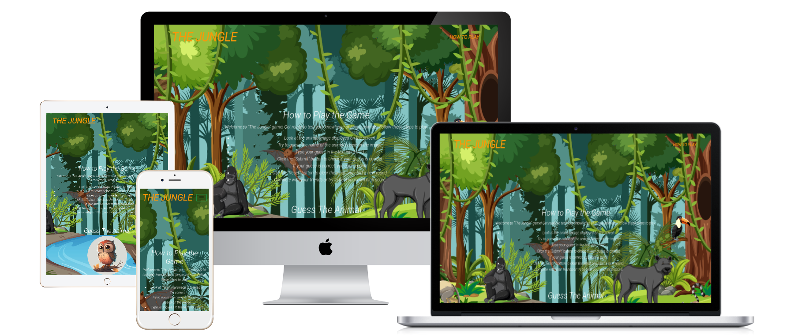
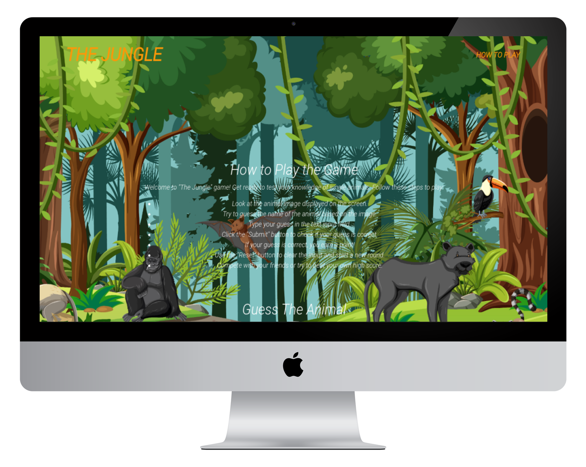
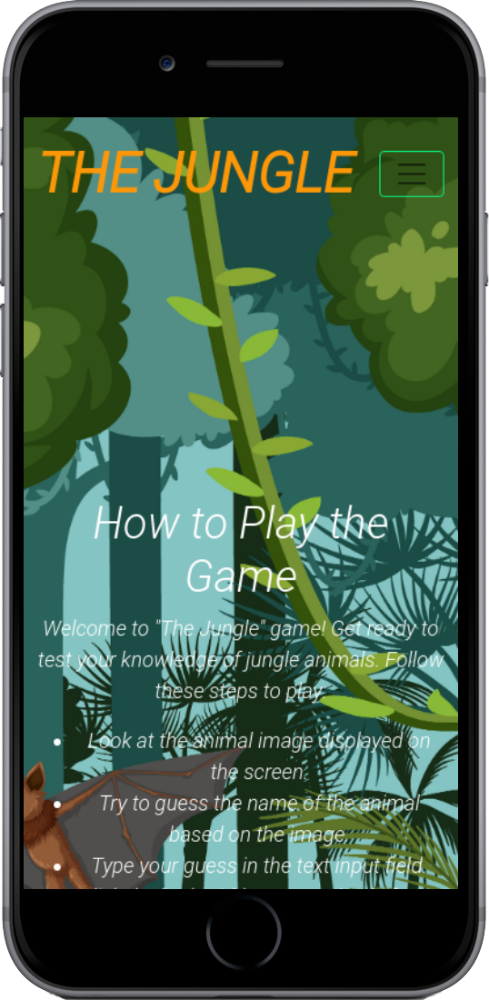

# wordgame

The WordGame is a simple JavaScript game where players take turns guessing the name of an animal based on its picture. The game keeps track of each player's score, and the first player to reach a score of 5 wins.

# Table of Contents
* [UX](#ux "UX")
    * [User Goals](#user-goals "User Goals")
    * [User Stories](#user-stories "User Stories")
    * [Site Owners Goals](#site-owners-goals)
    * [User Requirements and Expectations](#user-requirements-and-expectations)
         * [Requirements](#requirements)
         * [Expectations](#expectations)
     * [Design Choices](#design-choices)
        * [Fonts](#fonts)
        * [Colours](#colours)
        * [Structure](#structure)
    * [Wireframes](#wireframes)
    * [Features](#features)
        * [Existing Features](#existing-features)
            * [Landing Page](#landing-page)
    * [Technologies used](#technologies-used)
        * [Languages](#languages)
        * [Tools and Libraries](#tools-and-libraries)
    * [Testing](#testing)
        * [Unfixed Bugs](#unfixed-bugs)
    * [Deployment](#deployment)
    * [Credits](#credits)
* Ux

## User Goals
* Guess the Animal: Your primary goal is to guess the name of the animal displayed in the image correctly.

* Score Points: Each correct answer earns you one point. The game keeps track of your score, so try to accumulate as many points as possible.

* Compete with Others: Challenge your friends or family members to beat your score. The game supports multiplayer, allowing multiple players to take turns guessing the animals.

* Achieve Victory: The first player to reach a score of 5 wins the game. Strive to be the first to achieve this milestone!

* Improve Animal Knowledge: The game presents various animal images, providing an opportunity to learn and expand your knowledge of different species.

* Quick and Engaging Rounds: The game generates random animals for each round, ensuring that every game session is unique and exciting.

* Reset and Restart: If you want to start a new game at any time, click the "Reset" button. This will reset the scores and generate a new animal image, allowing you to begin a fresh round.

## User Stories
* As a player, I want to test my animal knowledge and see if I can correctly identify different species based on their pictures.

* As a competitive player, I want to compete with my friends or family members to see who can earn the highest score in the Animal Guessing Game.

* As a learner, I want to use the Animal Guessing Game as an educational tool to improve my knowledge of various animals and their characteristics.

* As a casual player, I want to enjoy a quick and engaging game session that offers entertaining challenges without requiring a significant time commitment.

* As a multiplayer enthusiast, I want to have the option to play the game with multiple players, allowing us to take turns and see who can reach the winning score first.

* As a beginner, I want clear instructions on how to play the game, including how to enter my guess, check the answer, and understand the feedback provided.

* As a returning player, I want the ability to reset the game easily and start a new round with fresh animal images and scores.section whith free wheights and other equipment.

## Site Owners Goals
* As the site owner, my goal is to create an enjoyable and engaging experience for young age players who want to test their animal knowledge.

* I aim to provide a visually appealing and user-friendly interface that enhances the gameplay and encourages users to continue playing.

* I want to encourage social interaction and friendly competition by implementing multiplayer functionality, allowing players to compete with their friends or family members.

* I strive to foster a learning environment where players can expand their knowledge of different animals and their characteristics.

* I aim to ensure that the game is accessible to a wide range of users, regardless of their level of experience or expertise in animals.

* I want to regularly update the game by adding new animal images and expanding the question bank, providing fresh challenges for players.

* I value user feedback and suggestions, as they help me improve the game and address any issues or concerns that players may have.

## user-requirements-and-expectations

## Requirements
* A web browser: The game is built using HTML, CSS, and JavaScript and can be played on any modern web browser.

* Internet connection: The game requires an internet connection to load the necessary assets, such as animal images.

## Expectations
*Fun and Challenging Gameplay: The WordGame offers an entertaining and engaging experience that challenges your animal knowledge and identification skills. Enjoy the thrill of guessing animals based on their pictures!

* User-Friendly Interface: The game features a clean and intuitive interface that allows for easy navigation and interaction. The input field for entering guesses, the submit button, and the feedback display are designed to be straightforward and user-friendly.

* Randomized Animal Images: Each round of the game presents a random animal image, ensuring a unique and unpredictable gameplay experience. You can expect a diverse range of animals to guess, keeping the game fresh and exciting.

* Immediate Feedback: The game provides immediate feedback on your answers. You'll know right away if your guess is correct or incorrect, allowing you to learn and improve with each attempt.

* Multiplayer Capability: The WordGame supports multiplayer functionality, enabling you to compete with your friends or family members. Take turns guessing the animals and see who can achieve the highest score or reach the winning score first.

* Scoring System: The game keeps track of your score as you progress. Each correct guess earns you a point, and the current scores of all players are displayed on the screen. Strive to achieve the highest score or be the first to reach the winning score!

* Educational Value: The game offers an opportunity to expand your knowledge of different animals and their characteristics. Whether you're a nature enthusiast or simply looking to learn something new, the Animal Guessing Game provides an enjoyable way to explore the animal kingdom.

* Resetting the Game: If you want to start a new game or reset the scores, you can easily do so with the provided "Reset" button. This allows you to begin fresh rounds and compete again for the highest score or victory.

# Design Choices

## Fonts
In order to move away from the basic fonts available, I have used 
[Google Fonts](https://fonts.google.com/ "Google Fonts") 
to find a text that best suits the feel of the website.
 For the main text I have chosen 
 [Roboto](https://fonts.google.com/specimen/Roboto "Roboto") 
 as I feel it is has a sharp, simple and easy to read look. 
 To make the headers and the stand out form the text.

#

I will explain the uses of the varius colours below, starting from top to bottom.

## Colours

 * rgb(252, 151, 8) - This colour will be used as h1.

 * rgb(255, 255, 255) - This colour will be used on h2 paragraphs and butoon background color.

 * rgb(238, 27, 55) - This colour will be used as a  reset botoom color and feedback.

 * rgb(22, 93, 6) - This colour will be used as a  submit botoom color.

## Structure
I will be building my website with a mobile first mindset using the iPhone 5/SE (320px) as the smallest screen size for styling to look good on. The screen size breakpoints that I will be using are from [Bootstrap breakpoints](https://getbootstrap.com/docs/5.0/layout/breakpoints/ "Bootstrap").

| Screen Size | Breakpoint |
| ----------- | ---------- |
| x-small     | <576px     |
| small       | => 576px   |
| medium      | => 768px   |
| large       | => 992px   |
| x-large     | => 1200px  |

## Wireframes
I have used [Balsamic](https://balsamiq.com/wireframes/ "Balsamic") to develop my wireframes for my website. I initially created the mobile version and then the wireframes and then scalled it up for both tablet and desktop. Because a requirement is to give little but quality information to the user to make them want to engage with the club, a one-page website is used. This gets the user through the content and quickly to the contact form and details via scrolling or directly via the navigation bar.

The wireframes are below:

###   [desktop view](wireframes/wireframesdesktop.jpg)

###   [phone view](wireframes/wireframesmobile.jpg)

###   [tablet view](wireframes/wireframestablet.jpg)

# Features

## Existing Features

### Landing Page

+ The landing page image gives the user instant knowledge of what is involved in the webpage, the images under show the diferet tipes of devices that the page can load .

# Desktop

# Mobile

# Tablet

# Deployment

Following writing the code then commiting and pushing to GitHub, this project was deployed using GitHub by the following steps.

+ Navigate to the repository on github and click 'Settings'.
+ Then select 'Pages' on the side navigation.
+ Select the 'None' dropdown, and then click 'master'.
+ Click on the 'Save' button.
+ Now the website is now live on https://emanuelcaires.github.io/wordgame/
+ If any changes are required, they can be done, commited and pushed to GitHub and the changes will be updated.

# Testing

I feel that the site has hit the goals required by all parties. 
The site responds nicely to all different screen sizes, 
the images look clean and sharp on all device sizes with very little, 
large blank spaces. It allows the user to navigate around easily and
 aslo make contact via the contact form or social media simply. It the content is simple and to the point and the site is not overcrowded as to put the user off.
\
&nbsp;

 To test the website i will use chrome develepor tools to resize my browser to emulate three mobile devices,(iphone 12 pro, iphone se pixel 5 ) and two tablets device (ipad air, ipad mini) and compare whit the wireframes that i created.The website it was responsive in all the mobile phone view and the tablet view,with one particular issue that was the burguer menu it did not collapse.after investigate i found that was using diferent version of bootstrap that was blocking to not colapse the nav menu.
 
+ During the validation process of my HTML, CSS, and JavaScript, I encountered a few minors issues that required attention. After making the necessary amendments, I revalidated the HTML CSS AND JAVASCRIPT it successfully passed without any errors.

    - HTML (index.html) validator [results]("https://validator.w3.org/")
    
    

    - CSS validator [results]("https://jigsaw.w3.org/css-validator/")

    

    - LightHouse Desktop

    

    - Lighthouse Mobile

    

+ After all i felt that the site has hit the goals.The site responds nicely to all types of devices that was tested, the images look clean and sharp this allow user to navigaate easily throuth the site not puting the user off.

+ While using the lighthouse dev tools to test the site I was prompt with delays to load the images due to the format i am  using.

\
&nbsp;

# Tech Stacks

## Languages
* [HTML](https://en.wikipedia.org/wiki/HTML "HTML")
* [CSS](https://en.wikipedia.org/wiki/CSS "CSS")
* [JS](https://en.wikipedia.org/wiki/JavaScript "JAVASCRIP")
## Libraries & Framework
* [Google Fonts](https://fonts.google.com/ "Google Fonts")
## Tools
* [Gitpod](https://www.gitpod.io/ "Gitpod")
* [Balsamic](https://balsamiq.com/wireframes/ "Balsamic")
* [W3C HTML Validation Service](https://validator.w3.org/ "W3C HTML")
* [W3C CSS Validation Service](https://jigsaw.w3.org/css-validator/ "W3C CSS")
* [Bootstrap](https://getbootstrap.com "Bootstrap")
* [Google Fonts](https://fonts.google.com/ "Google Fonts")

# Credits

For code testing, my soon Matias Caires

For Content and style insperation,
* [picresize](https://picresize.com/)
* [123rf](https://www.123rf.com//)

